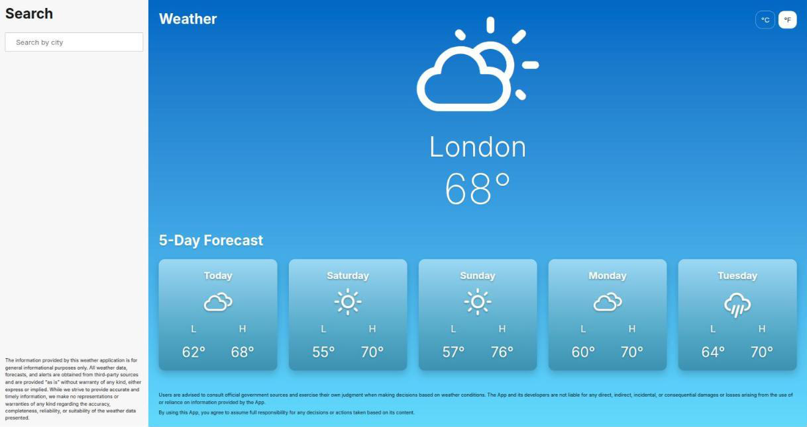

# Weather Forecast

City search with current conditions and a 5-day forecast.

**Live:** https://dev-pro-weather.vercel.app



## Stack

- **Next.js** — App Router, route handlers proxy OpenWeather so the API key stays server-side
- **React + TypeScript** — strict mode, no `any`
- **TanStack Query** — server state, caching, and deduplication
- **Zod** — validates raw provider responses at the adapter boundary
- **CSS Modules** — styling colocated with each component
- **Vitest + React Testing Library** — unit and component tests
- **Cypress** — end-to-end tests against intercepted routes
- **ESLint + Knip + Madge** — lint zones, dead code, and dependency cycles

## Requirements

- Node.js 22
- pnpm 11.22.0
- An OpenWeather API key

## Getting Started

```bash
pnpm install
cp .env.example .env.local
```

Set `OPENWEATHER_API_KEY` in `.env.local`, then:

```bash
pnpm dev
```

Open http://localhost:3000.

The key has no `NEXT_PUBLIC_` prefix on purpose — that would inline it into the browser bundle.
Tests run on committed fixtures and need no key.

## Commands

| Command | Purpose |
|---|---|
| `pnpm dev` | Start the development server |
| `pnpm build` | Create a production build |
| `pnpm start` | Start the production server |
| `pnpm lint` | Run ESLint with zero warnings allowed |
| `pnpm typecheck` | Run TypeScript without emitting files |
| `pnpm test` | Run the Vitest suite |
| `pnpm test:watch` | Run Vitest in watch mode |
| `pnpm e2e` | Run Cypress end-to-end tests |
| `pnpm check` | Run lint, typecheck, and unit tests |
| `pnpm quality` | Run check, build, dead-code, and circular-dependency checks |
| `pnpm deadcode` | Find unused files, dependencies, and exports |
| `pnpm circular` | Check the dependency graph for cycles |

## Technical Decisions

**Server-side API key** — a `NEXT_PUBLIC_` variable is inlined into the client bundle, so the key
is read only by the server-only adapter and browser requests go through our own route handlers.

**Adapter boundary** — the adapter absorbs OpenWeather's shape (ambiguous geocoding matches, forty
three-hour blocks, numeric condition IDs) so the rest of the application sees domain values.

**Caching** — geocoding caches for thirty days because coordinates rarely change; current weather
and forecast cache for ten minutes because conditions do.

**Separate geocoding** — a city name is not a unique location, so the user picks the intended city
before any weather is requested.

**State management** — TanStack Query owns server state and the workflow hook owns the search
query, selected city, and unit, so a state library would only add indirection.

**Temperature units** — the domain stores canonical Celsius and the °C/°F toggle converts at render
with `Intl.NumberFormat`, so switching units never creates a second cache entry.

## Architecture

```text
app/
  page.tsx              # layout: Search + WeatherBody
  components/
    Search/             # search screen
    WeatherBody/        # weather panel
  api/                  # route handlers compose the provider
    weatherProvider.ts  # Next cache + OpenWeather adapter
  useWeatherSearch/     # query + selected city
components/
  ui/                   # primitives
  Disclaimer/
lib/
  searchQuery/
  weather/
    client/       # browser access to our route handlers
    openweather/  # server-only provider adapter
    schemas/      # raw provider validation
    temperature/  # canonical Celsius, presentation conversion
    types.ts      # domain data
    provider.ts   # provider port
cypress/
test/            # factories, fixtures, http, render helpers
```

The page composes Search and WeatherBody. Routes talk to `WeatherProvider`; Next fetch cache lives in the app composition, not in the adapter. Components use domain types and client helpers; they cannot import the OpenWeather adapter or raw schemas. `lib/weather` does not depend on React or Next.js. ESLint zones and CI enforce it.
